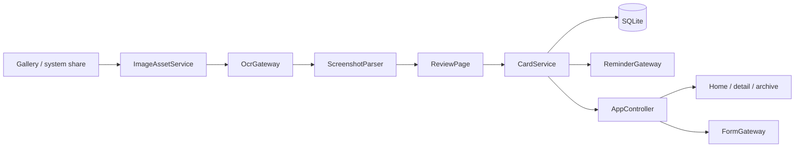

# Architecture

## 1. System boundary

FreshCue is a local-first Flutter application with a narrow HarmonyOS bridge. Flutter owns product state, parsing, persistence orchestration, and UI. ArkTS/C++ owns APIs unavailable to portable Dart: system share receiving, OCR, Reminder Agent, and Form Kit.

No account, cloud service, analytics, or network permission is part of the system.

## 2. Layers

| Layer | Responsibility | May depend on |
|---|---|---|
| `lib/core/` | Time abstraction, results/errors, logging/redaction, IDs | Dart SDK and lightweight libraries |
| `lib/domain/` | Entities, parser, freshness and reminder policies | `core` only |
| `lib/data/` | Repository implementations, SQLite, assets, orchestration | `core`, `domain`, platform contracts |
| `lib/platform/` | Gateway contracts, MethodChannel and Mock adapters | `core`, `domain`, Flutter services |
| `lib/app/` | Composition, controller, route/state coordination | all inner layers |
| `lib/features/` | Flutter pages and user interactions | app/domain presentation APIs |
| `ohos/` | HarmonyOS Ability, ArkTS plugins, C++ OCR | HarmonyOS SDK and Flutter OHOS engine |

Pages never write SQL or call ArkTS APIs directly. `CardService` owns cross-repository/platform transactions. `AppController` owns UI-visible state and publishes read-only service-card snapshots.

## 3. Import and parse flow

1. `ShareGateway` returns bytes and source metadata from a picker or incoming Want.
2. `ImageAssetService` validates image magic bytes, computes SHA-256, deduplicates, writes an unpredictable sandbox filename, and creates a thumbnail.
3. `OcrGateway` returns normalized text blocks. On HarmonyOS, `OcrPlugin` tries Core Vision, then offline PP-OCRv5/ncnn when Core Vision is unavailable or fails.
4. `ScreenshotParser` runs deterministic stages:
   - `TimeSpanExtractor`: locate absolute, relative, weekday and range expressions.
   - `DateNormalizer`: resolve against capture time; handle missing years, cross-year and leap-year cases.
   - `RoleClassifier`: score semantic roles by nearby keywords and distance.
   - `CategoryClassifier` and `FieldExtractor`: infer card type, title, location and temporary secret.
   - aggregation: build a `ParsedDraft` with candidates and evidence block IDs.
5. `ReviewPage` keeps every field editable and requires explicit confirmation.
6. `CardService.confirmCard` saves card/OCR/reminder intent, schedules platform instances, and reports partial scheduling failures without losing the card.
7. `AppController.refresh` recomputes derived freshness, then sends up to three non-sensitive active-card snapshots through `FormGateway`.

## 4. Lifecycle and reminder model

Stored card states: `draft`, `active`, `completed`, `archived`.

Derived states are evaluated at read time by `FreshnessPolicy`: `fresh`, `upcoming`, `urgent`, `expired`. They are never persisted.

`ReminderPlan` records intent such as “two hours before deadline.” `ReminderInstance` records a concrete trigger time, platform ID and execution status. `ReminderPolicy` expands plans while enforcing:

- no reminders in the past;
- deduplication at equal trigger times;
- quiet-hours adjustment for non-urgent reminders;
- independent failure handling per instance;
- snooze as a new instance linked to its source.

Editing a card time cancels old platform reminders before rebuilding instances. If rebuilding fails, successfully created platform reminders are cancelled and repository state is rolled back. Deletion cancels reminders and removes card, OCR, source metadata, sandbox image and thumbnail.

## 5. Platform contracts

Gateway contracts in `lib/platform/gateways.dart`:

- `OcrGateway`: image bytes → `OcrResult`, including explicit provider identity.
- `ShareGateway`: picker, initial share, hot-start share event stream.
- `ReminderGateway`: permission, schedule/cancel, notification action events.
- `FormGateway`: redacted card snapshot publication.

Channel names are `freshcue/capabilities`, `freshcue/ocr`, `freshcue/share`, `freshcue/share/events`, `freshcue/reminders`, `freshcue/reminders/events`, and `freshcue/forms`.

`PlatformCapabilities` distinguishes `compiled`, `available`, `reason`, and provider. Unknown or malformed bridge values fail closed. Release builds cannot enable Mock gateways. OHOS persistence selection depends on `Platform.operatingSystem` and a valid sandbox path, not the capability handshake.

## 6. Error, privacy and consistency invariants

- Cross-layer failures use `AppFailure` and stable `FailureCode`; UI shows `userMessage`, not raw exceptions.
- Domain time comes from injected `Clock`; tests use `FixedClock`.
- `IdGen` uses secure random 128-bit IDs for records and asset names.
- `AppLog` redacts phone numbers, identity/bank numbers, URL query values and secrets.
- OCR engine confidence and parser confidence are separate. Missing engine confidence remains `null`.
- Sensitive cards are excluded from Form Kit snapshots; notification payloads hide their content.
- The database is the source of truth for reminder intent; Reminder Agent is the executor. Startup reconciliation repairs stale instance status and missing platform IDs.
- SQLite migrations are append-only; current schema version is 2.

## 7. State management

`AppController` is one explicit `ChangeNotifier`. It owns active/expired lists, import stage, pending draft, capability state, routes from notification actions, and Form Kit publication. This is deliberate: the state graph is small, dependencies are constructor-injected, and adding a framework would duplicate existing composition without improving isolation.
